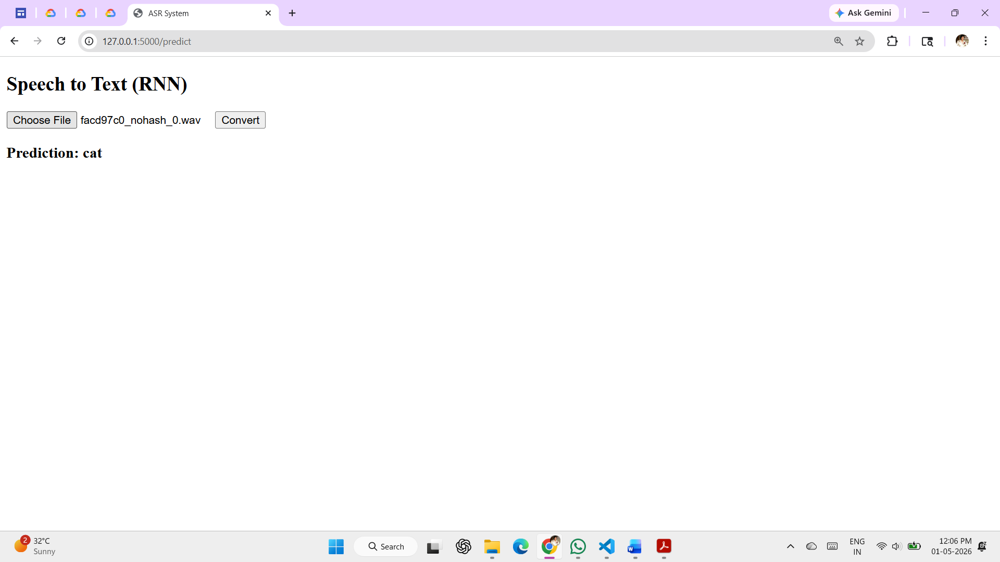

# 🎙️ Automatic Speech Recognition using RNN (LSTM)

## 📌 Project Overview
This project implements an Automatic Speech Recognition (ASR) system using Recurrent Neural Networks (RNN) with LSTM. The system converts speech audio into text using MFCC feature extraction and deep learning.

---

## 🚀 Features
- Speech-to-text conversion
- MFCC feature extraction
- LSTM-based deep learning model
- Flask web interface for audio upload
- Real-time prediction output

---

## 🧠 Technologies Used
- Python
- TensorFlow / Keras
- Librosa
- Flask
- NumPy
- Scikit-learn

---

## 📂 Project Structure
```
ASR_Project/
│── dataset/                # Audio dataset (not uploaded)
│── uploads/                # Uploaded audio files
│── static/
│   └── screenshots/
│       └── prediction_output.png
│── templates/
│   └── index.html
│── train.py
│── predict.py
│── app.py
│── utils.py
│── asr_model.h5            # Trained model (not uploaded)
│── label_encoder.pkl
│── max_len.pkl
│── README.md
```

---

## 📸 Output Screenshot

<p align="center">
  
</p>

---

## ⚙️ Installation

```bash
pip install numpy librosa tensorflow scikit-learn flask
```

---

## ▶️ How to Run

### 1. Train the Model
```bash
python train.py
```

### 2. Run Flask App
```bash
python app.py
```

### 3. Open in Browser
```
http://127.0.0.1:5000/
```

---

## 📊 Model Details
- Feature Extraction: MFCC (13 coefficients)
- Model: LSTM (Recurrent Neural Network)
- Loss Function: Sparse Categorical Crossentropy
- Optimizer: Adam

---

## ⚠️ Notes
- Dataset is not included due to size
- Model file is not uploaded (can be generated using train.py)

---

## 🚀 Future Improvements
- 🎤 Live microphone input
- 🧠 Continuous speech recognition (full sentences)
- 🎨 Improved UI/UX
- 📊 Confidence score display

---

## 👨‍💻 Author
Mrunal Fattepurkar
